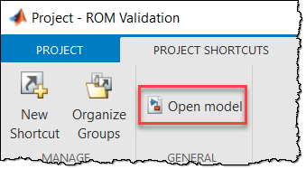

# Reduced-Order Flexible Cylinder in Simscape Multibody
Copyright 2021 - 2022 The MathWorks, Inc.

This project will get you started with the [Reduced Order Flexible Solid](https://www.mathworks.com/help/releases/R2020b/physmod/sm/ref/reducedorderflexiblesolid.html) block in [Simscape Multibody](https://www.mathworks.com/products/simscape-multibody.html)™. The project contains:
- A reduced-order model for a cylinder
- A Simulink® model that tests the behavior of the cylinder under certain loading conditions. The model also compares the reduced-order model response to the [Flexible Cylindrical Beam](https://www.mathworks.com/help/releases/R2020b/physmod/sm/ref/flexiblecylindricalbeam.html) and the analytical solution for each loading condition.
- A script that shows you how to generate a reduced-order model using the [Partial Differential Equation Toolbox](https://www.mathworks.com/products/pde.html)™

A reduced-order model for the cylinder is provided, but the project is set up so you can substitute in your own reduced-order model generated from your finite element analysis (FEA) software. Using this simple geometry will help you see how configuration settings in your FEA tool translate into Simscape Multibody™.

See this [blog post](https://blogs.mathworks.com/simulink/?p=10056) for a high level overview of the Reduced Order Flexible Solid block.

# Getting Started
All of the files are organized in a [MATLAB Project](https://www.mathworks.com/help/releases/R2020b/matlab/projects.html?s_tid=CRUX_lftnav). You can simply open the project to get started. The intended way to use the files in the project is:

1. In your FEA software of choice, generate a reduced-order model (ROM) for a cylindrical beam with these properties:
    - Radius: r = 0.05 m
    - Length: L = 1 m
    - Density: rho = 2700 kg/m^3
    - Youngs Modulus: E = 70 GPa
    - Poisson ratio: 0.33
    - 2 boundary nodes (one at each face of the cylinder)
2. Enter the generated ROM data into the Reduced Order Flexible Solid block in the `compareFlexibleCylinders` model
3. Run the simulation and compare the simulation result for your ROM to the analytical solution provided. The beam can be tested under the loading conditions described below.

## Simulink model
When you open the MATLAB Project, the `compareFlexibleCylinders` model should open automatically. If it doesn't, you can use the project shortcut to open it:

The model will look something like this:

Once you have generated the ROM for a cylinder with the properties mentioned above, you can use the `compareFlexibleCylinders` model to test the ROM under different loading conditions. 

In the model I use the [Flexible Cylindrical Beam](https://www.mathworks.com/help/releases/R2020b/physmod/sm/ref/flexiblecylindricalbeam.html?s_tid=doc_ta) as a baseline to compare the ROM response. 

The Reduced Order Flexible Solid block in the model is already populated with ROM data for a cylinder:

You can replace that data with the cylinder ROM data you have generated from your FEA software. When you enter your ROM data, Note that you may have to modify the Rigid Transforms to orient your component properly. It should look like this when you open the Mechanics Explorer:

All of the loading will happen in the coordinate frame shown in the image above. For instance, a force along the x-axis would put the beam in tension, a torque about the x-axis would put the beam in torsion, and a force applied along the z-axis would put the beam in bending.

### Loading conditions
This model uses [Variant Systems](https://www.mathworks.com/help/releases/R2020b/simulink/variant-systems.html?s_tid=CRUX_lftnav) to switch between the different loading conditions.

All of the variants are controlled by a variable in the Base Workspace named `ValidationTest`. You use the links available inside the model to modify `ValidationTest`.

After you run a simulation, the [Simulation Data Inspector](https://www.mathworks.com/help/releases/R2020b/simulink/slref/simulationdatainspector.html) will open automatically and display the results. You can also choose to plot the results in MATLAB®:

## Analytical solution to the loading conditions
The Simulink model also computes the analytical solution for some of the loading conditions.

### Tension
If you apply a force `F` along the axis of the beam, you should get a steady state deformation of

where `A` is the cross-sectional area of the beam, `E` is the Youngs Modulus, `L` is the length of the beam. 
### Torsion
If you load the beam in torsion with torque `T` you should get a steady state angle of twist of 

Where `G` is the shear modulus, `Ip` is the polar moment of inertia 
### Bending
For this one I chose to look at the frequency of the response instead of the steady state behavior. If you apply a pulse to the end of the beam in a direction perpendicular to the axis of the beam, you should get a response that oscillates at the first natural frequency of the beam 

Where `I` is the moment of inertia, `p` is density, `A` is cross sectional area, `E` is Youngs Modulus.  

## Generating a ROM using the PDE Toolbox
If you have a license for the [PDE Toolbox](https://www.mathworks.com/products/pde.html), you can use the toolbox to generate a reduced-order model for your CAD component. Open the `generate_cylinder_ROM` live script to learn how to do that. 

You can also refer to the [Flexible Dipper](https://www.mathworks.com/help/releases/R2020b/physmod/sm/ug/model-excavator-dipper-arm.html
) example in the documentation.

## Troubleshooting
If you are seeing incorrect results, first make sure your ROM meets the [reduced-order model requirements](https://www.mathworks.com/help/releases/R2020b/physmod/sm/ref/reducedorderflexiblesolid.html#mw_d65e4979-2dd1-42cd-a57e-428f4e3463bd).

The following sections walk through a few other things you can check.

### Check 1: Confirm you have 6 eigenvalues near zero
Assuming your stiffness matrix is `K` and your mass matrix is `M`, you can use MATLAB to compute the eigenvalues for your ROM as follows:

``>> lambda = eig(K,M);``

Then you should check that you have 6 eigenvalues that are near zero. These 6 zero eigenvalues correspond to the rigid body modes for your component. You can do that with this code:

``>> assert( all(abs(mink(lambda,6)) < 1e-3) )``

### Check 2: Orientation of the ROM
Check to make sure your ROM is oriented properly. If it is oriented properly, it will look like this in the Mechanics Explorer:

Note the orientation of the frames in that picture and make sure your frames are oriented the same. If they aren't, then you will have to modify these Rigid Transforms:

### Check 3: Direct comparison of stiffness and mass matrices
If none of the above steps resolve the issue, then you can do a direct comparison of your matrices with the ones provided in this project. You will find the matrices in a struct named `cyl` (which is saved in ROMS/PDE_ROM.mat) where `cyl` is defined as follows:
- `cyl.P`: Matrix of interface frame origins
- `cyl.K`: Stiffness matrix
- `cyl.M`: Mass matrix 

As long as your interface frames matrix matches cyl.P, you should be able to do a direct comparison of the matrices. 

## References
[Craig-Bampton FEA substructuring method](https://hal.science/hal-01537654/file/RCMB.pdf)
